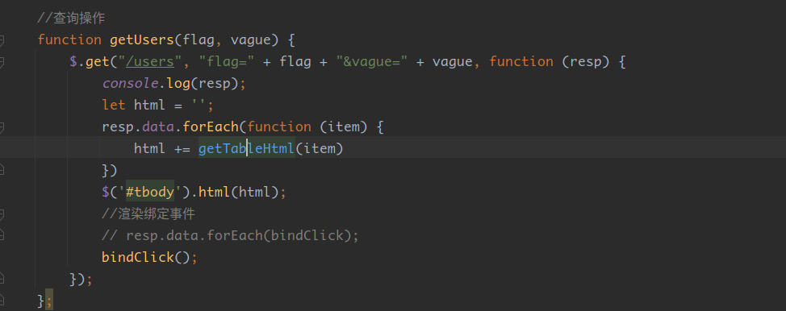
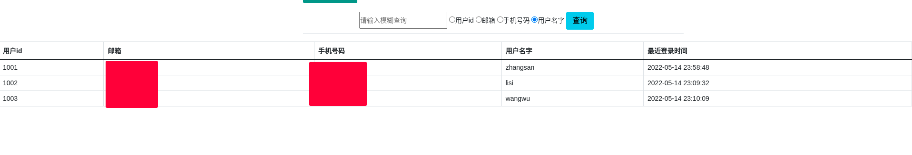

## 四六级报名系统项目说明书

> 课程设计

自己写一个类四级报名系统

### 功能简述：

主要是分有三种角色，管理员、教师、以及学生，每个角色登录进来同一个访问地址但是界面功能不一样。

严格遵守RESTful风格接口.接口因角色不同而赋予请求权限.

找回密码需要发送邮箱验证码.

数据自动迁移,不需要导入sql文件.

登录验证，可以使用手机号和邮箱号，模糊查询，Excel表格导入学生。

增删改查等基础功能

### 1、数据库设计：

主要业务为四张表

- user


- user_personal


- role


- user_role


- 四表联系如下

  

#### 1.1、自动迁移

> 自动迁移： 自动迁移为表结构及其默认数据为程序在运行时自己生成，不需要手动导入sql文件，
>
> 当然生产环境需要禁止该功能，本项目为demo课设，所以我手动实现了自动迁移功能，以此来提高程序移值性.

- 主要类 AutoMigration

  

- 通过SpringUtil获取对应的bean来进行调用,这样就达到了，数据不存在表结构时，会自己去创建，并且会生成一些默认的数据，具体看代码.


### 2、业务设计

1、使用spring做对象管理。

2、使用springMVC做接口暴露，返回界面或者json数据。

3、使用mybatis操作MySQL数据库。

4、使用spring security做认证和授权，学生登录该系统，只能报名。而管理员则可以导入用户或学生信息。

5、使用EasyExcel操作Excel进行大批量的数据导入，存储在数据库。

6、使用thymeleaf实现动态模板渲染。

7、使用jquery发送ajax请求,使用layui和bootstrap优化页面样式。

### 3、具体实现

#### 1、首页即登录页


###### 1.1、可用邮箱和手机登录

> 需要做一层正则判断来验证是手机还是邮箱进行的登录.

具体实现如下


###### 1.2、其他一些按钮功能

- 找回账号和点击注册功能无、只有基本的提示。


- 重置可以清空账号密码的输入框内容


- 忘记密码需要使用已经存在系统的邮箱接收验证码邮件，以此来重置密码


- 如果不填写邮箱直接获取验证码则会聚焦邮箱输入框，并提示你先输入邮箱


- 如果输入的邮箱不满足邮箱正则表达式，为非法邮箱


- 参数全部输入正确，且两次密码一致，验证码验证成功,点击确定则修改成功


- 验证码邮件内容

  > 图片是我使用阿里的oss再通过随机函数生成，详情请看以下代码


- 验证码实现代码为/user/captcha接口，以下为核心代码

  ```java
   MimeMessageHelper helper = new MimeMessageHelper(mimeMessage, true);
   helper.setSubject("四六级系统(demo)重置密码请求");
   //内容
   helper.setText("<b style='color:hsl(200, 50%, 60%);'>"+"您的验证码为:"+captcha+"</b><p><b>请妥善保管,不要给他人使用，如不是您申请的，请忽略.</b><p></img>",true);
   helper.setTo(userPo.getEmail());
   helper.setFrom("ylzlcl@163.com");
   //发送
   javaMailSender.send(mimeMessage);
  ```

  

#### 2、根据角色不一样、登录进来后界面不一样

###### 2.1、管理登录后


###### 2.2、教师登录后


###### 2.3、学生登录后


###### 2.4 、相同界面不同展示主要实现代码

- 前端(thymeleaf)主要实现

```html
<!--学生权限才能访问该div -->
<div sec:authorize="hasRole('STUDENT')"></div>
<!--管理员权限才能访问该div -->
<div sec:authorize="hasRole('ADMIN')" ></div>
<!--老师权限才能访问该div -->
<div sec:authorize="hasRole('TEACHER')" ></div>
```

- 后端主要实现

> 主要思路-通过数据库先查寻登录的角色集合，记住一定是一个集合，因为有多重角色，再将角色集合和用户交给security去托管，security和thymeleaf进行交互则实现同样一个界面，因角色不同而不同.


2.5、接口和界面限制角色访问


> 情景一：如果你没有登录访问一些非公开的地址和界面则会重定向登录界面。
>
> 情景二：你登录了账号，但是该账号没有请求地址或者界面的权限，则会重定向到自定义的403界面,如下图.


#### 3、管理员通过excel导入用户数据、查找用户以及增删改查

###### 3.1、列表实现

- #### 表格列表采用接口请求数据，jquery拼接渲染形式




###### 3.2、表格

> 主要是对应了PersonalInfoBo对象, 通过对象来绘制表格

- 表格样式


当然也可以从这里下载模板文件


###### 3.3、根据条件模糊查询



- 实现是通过一个flag值来进行匹配


- 上传文件之后自己增加用户，默认导入用户角色为学生，默认密码为邮箱前四位+手机号码后四位。


- 编辑操作，id和最近登录时间为不可编辑，密码修改为选填。


- 详情

三个系统用户不可查看,因为他们没有详细信息


excel添加的用户可查看他们信息


这边为grid布局, 使用layui的弹出层组件实现


#### 4、容器部署以及半自动化运维

###### 4.1、Dockerfile

```Dockerfile
FROM java:8

# 镜像
MAINTAINER ylzlcl@163.com

# 拷贝java的二进制包
COPY ./target/cet4-0.0.1-SNAPSHOT.jar /app.jar

# 端口
EXPOSE 5000
# 运行
ENTRYPOINT [ "java","-Dspring.profiles.active=prod","-Djava.security.egd=file:/dev/./urandom","-jar","/app.jar" ]
```

###### 4.2、idea配置, 直接构建镜像并运行容器


###### 4.3、点击运行idea docker配置文件

> 首次会拉取远程dockerhub构建镜像，会比较慢


- 运行完成之后无报错日志即可使用ip+端口访问了

> 因为我这里是本地，如果是远程推送到公网服务器，那么这里就已经完成了一次版本迭代过程了

- 测试

> 确保服务和mysql启动中


- 查看自己ip地址为：192.168.31.43  (我本地ip,如果是公网服务器则直接用公网ip或者域名)

> 直接ip+端口访问


到此就已经完成该项目的部署上线了.